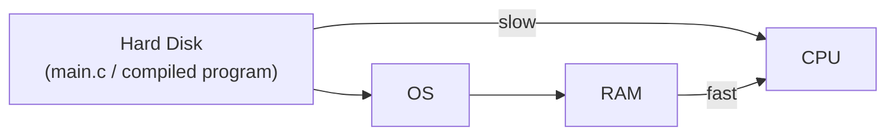
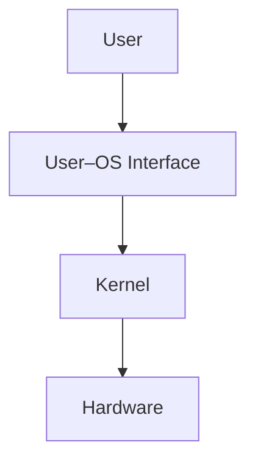
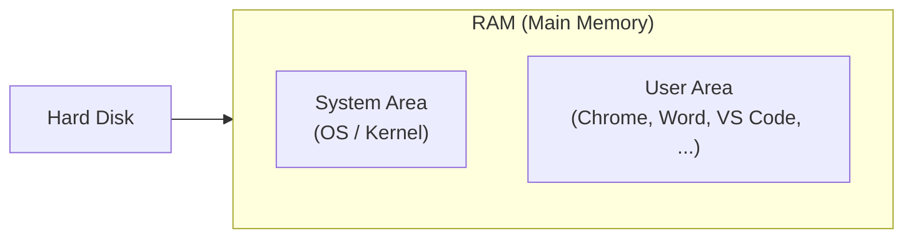
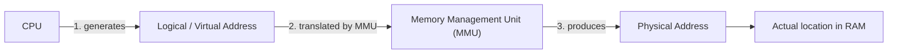

# Operating Systems — Notes

> Personal lecture notes on Operating Systems fundamentals: CPU architecture, memory, OS structure, multiprogramming, scheduling, and memory management.

## Table of Contents

1. [Structure of the CPU](#1-structure-of-the-cpu)
2. [Memory](#2-memory)
3. [What Does an Operating System Do?](#3-what-does-an-operating-system-do)
4. [Types of Operating Systems](#4-types-of-operating-systems)
5. [Multiprogramming — Scheduling Types](#5-multiprogramming--scheduling-types)
6. [Architectural Requirements for a Multiprogrammed OS](#6-architectural-requirements-for-a-multiprogrammed-os)
7. [CPU Dual-Mode Operation](#7-cpu-dual-mode-operation)
8. [Glossary](#8-glossary)

---

## 1. Structure of the CPU

The CPU (Central Processing Unit) is built from three main parts:

| Component | Full Name | Role |
|---|---|---|
| **ALU** | Arithmetic Logic Unit | Performs math and logic operations |
| **CU** | Control Unit | Directs execution, fetches/decodes/sequences instructions |
| **Registers** | — | Small, ultra-fast internal memory used mid-execution |


### 1.1 Control Unit (CU)

The Control Unit is often described as the **"brain" of the computer**. It doesn't do the actual math — it **runs tasks and executes instructions in sequence**, coordinating the ALU, registers, and memory.

**Example instruction sequence** (what a CU actually processes):

```asm
Load R1, a
Load R2, b
Add  R1, R2
```

These low-level instructions are called **micro-operations** — they are the *compiled* form of a higher-level program statement. For example, a single line of C++:

```cpp
a + b
```

compiles down into exactly the sequence above: load `a` into register `R1`, load `b` into register `R2`, then add the two registers.

### 1.2 Arithmetic Logic Unit (ALU)

The ALU performs **all mathematical and logical operations** in the CPU. Concretely, the ALU is responsible for:

- **Arithmetic**: solving expressions like `a + b` that the CU hands it from the compiled program.
- **Logic / conditionals**: evaluating conditional statements (`if`, `while`, comparisons) in a program — these decisions are made by the ALU.
- **Address calculation**: memory addresses used by the CPU are calculated by the ALU.

> **Takeaway:** the CU is the *coordinator*, the ALU is the *calculator*. The CU tells the ALU *what* to compute; the ALU does the actual computing.

---

## 2. Memory

Memory in a computer system spans several types, ordered here roughly fastest → slowest:

- **Registers** (inside the CPU)
- **Cache**
- **RAM** (main memory)
- **ROM**

### 2.1 How Are Programs Executed / Run?

The path from source code to a running process:


The `.exe` file contains **instructions** generated from the original source code. Once the OS is involved:

1. The OS loads those instructions into **main memory (RAM)**.
2. The CPU **starts executing them one by one**.

> **The OS's core job here is to move the program from the hard disk into computer memory (RAM) so it can be executed.**

### 2.2 Diagram: Why Programs Go Through RAM First



- **Hard Disk → CPU directly**: **slow**.
- **RAM → CPU**: **fast**.

**Why?** A program stored on the hard disk (HD) can't keep up with the speed at which the RAM and CPU operate — HD access is orders of magnitude slower. So the OS first copies (passes) the program from the HD into RAM (main memory), and the CPU reads and executes from RAM instead of going to disk directly for every instruction.

---

## 3. What Does an Operating System Do?

At the simplest level, an OS takes operations requested by the user and carries them out on the hardware:


### 3.1 Modules of the OS (The Kernel)

The OS is made up of several cooperating modules. Together, these modules form the **Kernel**:

| Module | Manages |
|---|---|
| **Process Manager** | The CPU (which process runs, when) |
| **Memory Manager** | Memory (RAM allocation) |
| **File Manager** | Files (as a resource) |
| **Protection Manager** | Resources (security/access control) |
| **Device Manager** | Devices (I/O hardware) |

### 3.2 Two Levels of the OS

An OS operates on two conceptual levels:

1. **User–OS Interface** — takes commands *from* the user and passes them down to the kernel. This is the layer the user directly interacts with (shell, GUI, system calls).
2. **Kernel** — actually performs the requested operation *through* the hardware, and returns the result back up.



### 3.3 Goals of an Operating System

| Goal | Notes |
|---|---|
| **Convenience** | Easy for the user to interact with the system |
| **Efficiency** | Makes good use of CPU, memory, and other resources |
| **Reliability** | Consistently behaves correctly |
| **Robustness** | Handles errors/failures gracefully |
| **Scalability** | Performs well as load/resources grow |
| **Portability** | ⭐ **Primary goal** — the OS should run across many different devices. Unlike Apple's ecosystem (which is tightly coupled to Apple's own hardware and doesn't run on arbitrary devices), **Windows is considered the best fit for portability**, since it runs across a huge range of third-party hardware. |

---

## 4. Types of Operating Systems

### 4.1 Multiprogramming OS

A **multiprogramming OS** helps the system run **more than one application at a time**.

**Example:** You open VS Code. The OS gives VS Code a dedicated space in RAM so the CPU can start executing the instructions inside it. At the *same time*, Spotify can be running, occupying a different address in RAM.

**Walkthrough — why this matters:**

1. VS Code requests a file from the hard disk (e.g. "open this file").
2. Reading from disk **takes time** — and during that wait, the CPU would otherwise sit idle.
3. Instead, the OS assigns the CPU to **Spotify** while VS Code's file request is being serviced.
4. When the file is ready, whatever work was in progress is **saved in a register**.
5. The CPU then **returns its attention to VS Code**, now that its data is ready.

This context-switching between programs is exactly what "multiprogramming" enables.

### 4.2 3rd Generation of Operating Systems

The 3rd generation of OS began with systems like **OS/360**, and introduced two types of OS:

- **Uniprogrammed**
- **Multiprogrammed**

### 4.3 I/O-Bound Operations

**I/O (Input/Output) bound** describes a program that is currently **waiting for, or performing, operations with something outside the CPU** — rather than doing CPU computation.

Examples:
- Keyboard: waiting for the user to type.
- Disk: waiting for a file to be read or written.

These operations **don't need the CPU** while they're happening — so the CPU sits **idle**. This directly works *against* one of the OS's core goals (**efficiency**), because it drops both **throughput** and **efficiency**.

> **Historical example:** **MS-DOS** (a disk operating system from the early 1980s–90s, command-line based) is a classic example of an OS heavily affected by I/O-bound, single-tasking limitations.

### 4.4 What Multiprogramming OS Actually Does

A multiprogramming OS allows **multiple programs to sit in RAM at once**, which lets the CPU execute instructions belonging to several different programs.

> **Important nuance:** the CPU itself can still only run **one program's instruction at a time** — a single CPU core cannot literally execute two instructions simultaneously. What the OS does is **rapidly switch between programs**, maximizing:
> - CPU utilization
> - Efficiency
> - Throughput
>
> This rapid switching is what gives the *appearance* of multitasking — and is the whole purpose of multitasking.

### 4.5 Uniprogramming

**Uniprogramming** is the ability of the OS to hold **only one application in memory at a time**.

### 4.6 Diagram: Memory Layout — User Area vs System Area

Programs such as Chrome, Word, and VS Code live in the **User Area** of RAM. The **System Area** is a protected, secure region of RAM reserved for the OS itself.



The System Area is protected so that it **cannot be tampered with** by ordinary applications — e.g. Chrome, VS Code, or Word are not allowed to reach in and access or modify the OS's own memory. All regular user programs are confined to running inside the User Area.

**Efficiency comparison:**

| | Programs in memory | CPU behavior when idle | Efficiency |
|---|---|---|---|
| **Uniprogramming** | 1 at a time | CPU does **nothing** while the one program is idle/blocked | Less efficient |
| **Multiprogramming** | Multiple at once | OS switches CPU to another ready program | More efficient |

**Throughput** = the number of programs completed in a given unit of time.

---

## 5. Multiprogramming — Scheduling Types

Since there is only **one CPU**, and it can only execute one instruction stream at a time, the OS needs a strategy for **when to switch** between programs. There are two broad approaches:

### 5.1 Pre-emptive Scheduling

The OS can **interrupt a running program before it's finished**, and hand the CPU to another program.

**Example walkthrough:**
- Program **A** is running in RAM.
- Whether or not A has *finished* executing its instructions, once it's the next program's (**B**'s) turn, the OS **passes control to B** anyway.
- This decision is driven by a **time-range priority** — a scheduling scheme that determines which program needs the CPU next, based on time slices and priority.

### 5.2 Non-preemptive Scheduling

The OS **waits** for the currently running program to finish, before switching to anything else.

**The OS only hands off control when:**
- the program **says it's done**, **or**
- the program needs to perform an **I/O operation**.

Only then does the OS pass the CPU to the new (next) program.

### 5.3 Comparison

| | Pre-emptive | Non-preemptive |
|---|---|---|
| **Can interrupt a running program?** | Yes | No |
| **Switch trigger** | Time-range priority / time slice expiry | Program finishes, or requests I/O |
| **Responsiveness** | Higher — no program can hog the CPU indefinitely | Lower — a long-running program can delay others |

### 5.4 Degree of Multiprogramming

The **degree of multiprogramming** is the number of programs that can be loaded into memory (RAM) at the same time, under the OS.

---

## 6. Architectural Requirements for a Multiprogrammed OS

Building an OS capable of multiprogramming isn't just a software decision — it requires specific hardware support.

### 6.1 DMA Support (Direct Memory Access)

SSD / disk I/O must support **DMA (Direct Memory Access)** — meaning I/O devices must be able to transfer data **efficiently**, without requiring the CPU to babysit every byte of the transfer. This frees the CPU to work on other programs while I/O happens in the background.

### 6.2 Address Translation Support

The memory system must support **address translation** — converting between two kinds of addresses:



- **Logical Address (Virtual Address)**
  Occurs whenever the CPU needs to **read or write data in memory**. Instead of directly using a real memory location, the CPU is given a **virtual address** to work with.

- **Physical Address**
  After the CPU has been assigned a virtual address for a program, it uses the **MMU (Memory Management Unit)** — a hardware component that **translates the virtual address into the actual physical address** in RAM.

**Why this matters:** address translation is what allows multiple programs to each believe they have their own private memory space, while the OS safely maps all of them into the same physical RAM.

---

## 7. CPU Dual-Mode Operation

To protect the system, the CPU operates in **two distinct modes**:

| Mode | Value | Purpose |
|---|---|---|
| **Kernel mode** | `0` | Full, unrestricted access — used by the OS/kernel itself |
| **User mode** | `1` | Restricted access — used by ordinary user programs |

This separation is what allows the **Protection Manager** (see [Section 3.1](#31-modules-of-the-os-the-kernel)) to stop regular applications from directly touching hardware or the OS's own memory (the **System Area**, see [Section 4.6](#46-diagram-memory-layout--user-area-vs-system-area)) — any such access has to go through the kernel via a controlled system call.

---

## 8. Glossary

| Term | Meaning |
|---|---|
| **ALU** | Arithmetic Logic Unit — performs math/logic operations |
| **CU** | Control Unit — sequences and coordinates instruction execution |
| **Kernel** | The core of the OS; combines process, memory, file, protection, and device managers |
| **Micro-operation** | A single low-level compiled instruction (e.g. `Load`, `Add`) |
| **Multiprogramming** | Ability to hold multiple programs in memory and switch the CPU between them |
| **Uniprogramming** | Ability to hold only one program in memory at a time |
| **I/O-bound** | A program state where it's waiting on input/output rather than using the CPU |
| **Throughput** | Number of programs completed per unit of time |
| **Pre-emptive scheduling** | OS can interrupt a running program to switch to another |
| **Non-preemptive scheduling** | OS waits for a program to finish or request I/O before switching |
| **Degree of multiprogramming** | Number of programs that can be loaded into RAM at once |
| **DMA** | Direct Memory Access — lets I/O devices transfer data without CPU involvement for every byte |
| **Logical/Virtual Address** | The address the CPU uses, before translation |
| **Physical Address** | The real address in RAM, after translation |
| **MMU** | Memory Management Unit — hardware that translates virtual → physical addresses |
| **Kernel mode** | Privileged CPU mode (0) — full hardware access |
| **User mode** | Restricted CPU mode (1) — used by ordinary applications |

---

*Compiled from personal lecture notes.*
